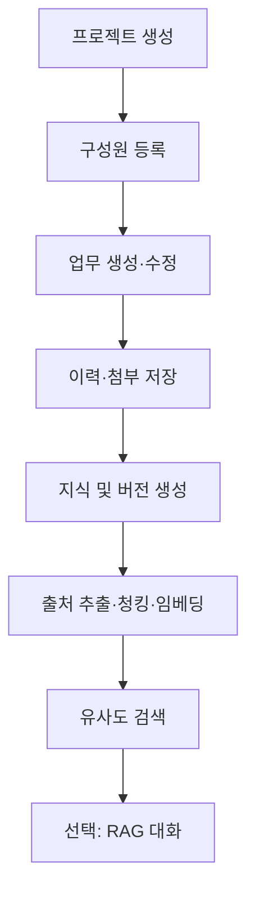
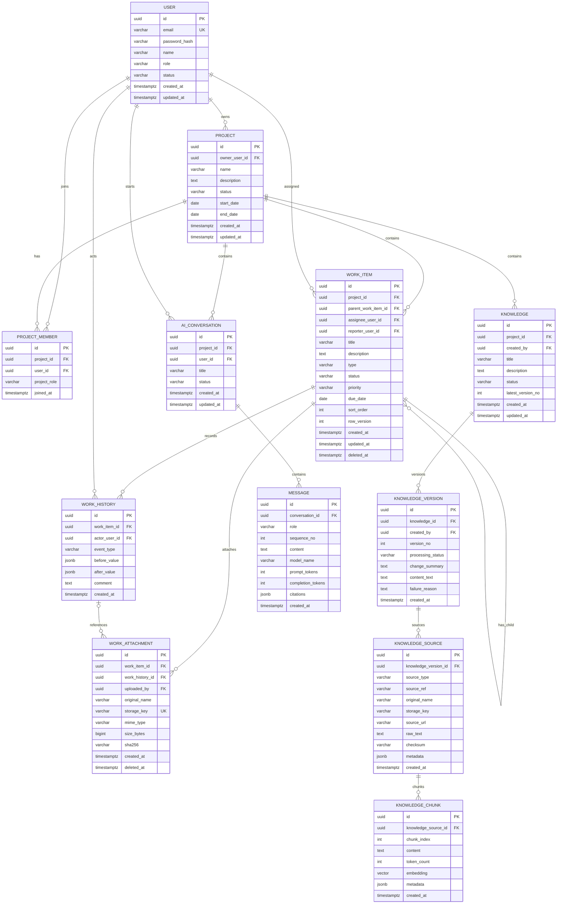

# 남도ON PoC 도메인 배분·API 명세·ERD

> 문서 버전: v0.1  
> 작성일: 2026-09-07  
> 기준 기술 스택: React, Spring Boot, PostgreSQL + pgvector, Naver Cloud Object Storage  
> 목표: 3인 개발·3일 PoC에서 프로젝트 업무관리와 지식 검색을 우선 완성하고, AI 대화 기능은 확장 단계로 분리한다.

## 1. 설계 원칙과 범위

### 1.1 단계별 범위

| 단계 | 엔티티 | PoC 목표 |
| --- | --- | --- |
| Bare Minimum | `USER`, `PROJECT`, `PROJECT_MEMBER`, `WORK_ITEM`, `WORK_HISTORY`, `WORK_ATTACHMENT`, `KNOWLEDGE`, `KNOWLEDGE_VERSION`, `KNOWLEDGE_SOURCE`, `KNOWLEDGE_CHUNK` | 사용자와 프로젝트를 생성하고, 업무·이력·첨부를 관리하며, 업무 또는 문서를 지식화하여 유사도 검색한다. |
| Advanced | `AI_CONVERSATION`, `MESSAGE` | 검색 결과를 근거로 답변하고, 대화와 메시지 이력을 저장한다. |

`PROJECT_MEMBER`는 제시된 목록에는 없지만 사용자와 프로젝트의 다대다 관계, 프로젝트별 역할 및 접근 권한을 표현하기 위해 추가한 보조 엔티티다.

### 1.2 구현 형태

- PoC에서는 하나의 Spring Boot 애플리케이션 안에 패키지를 분리한 **모듈형 모놀리스**를 권장한다.
- 각 담당자는 자신의 도메인에 대한 Entity, Repository, Service, Controller, 테스트를 수직으로 구현한다.
- 다른 도메인의 테이블을 Repository로 직접 조회하지 않고, 공개 Service 또는 도메인 이벤트를 통해 연계한다.
- 첨부파일 원본은 Object Storage에 저장하고 DB에는 `storage_key`, 파일명, 크기, MIME 유형, 해시값만 저장한다.
- 지식 청크 임베딩은 PostgreSQL `vector` 컬럼에 저장한다. 임베딩 차원은 선정 모델에 맞춰 마이그레이션에서 확정한다.
- 모든 주요 PK는 UUID를 사용하고, 시간은 DB에 UTC로 저장한 후 클라이언트에 ISO 8601 형식으로 반환한다.

## 2. 3인 도메인 배분

| 담당 | 바운디드 컨텍스트 | 담당 엔티티 | 핵심 구현 | 다른 담당자에게 제공할 계약 |
| --- | --- | --- | --- | --- |
| 개발자 1 | Identity & Project | `USER`, `PROJECT`, `PROJECT_MEMBER` | 로그인/JWT, 사용자, 프로젝트, 프로젝트 구성원, 역할 기반 접근 제어, 공통 예외·응답 규격 | `ProjectAccessService`, 현재 사용자 식별 규칙, 프로젝트/회원 조회 API |
| 개발자 2 | Work Management | `WORK_ITEM`, `WORK_HISTORY`, `WORK_ATTACHMENT` | 업무 CRUD, 상태 전이, 담당자 지정, 변경이력, 댓글성 이력, 파일 업로드·다운로드 | `WorkItemQueryService`, `WorkItemChangedEvent`, 첨부 메타데이터 조회 API |
| 개발자 3 | Knowledge & AI | `KNOWLEDGE`, `KNOWLEDGE_VERSION`, `KNOWLEDGE_SOURCE`, `KNOWLEDGE_CHUNK`, 확장 시 `AI_CONVERSATION`, `MESSAGE` | 지식·버전·출처 관리, 텍스트 추출, 청킹, 임베딩, 벡터 검색, 선택적으로 RAG 대화 | `KnowledgeSearchService`, 인덱싱 상태 API, 검색 및 대화 API |

### 2.1 업무량 조정 원칙

- 개발자 3은 Bare Minimum에서 **지식 등록·인덱싱·검색**까지만 우선 완료한다.
- `AI_CONVERSATION`과 `MESSAGE`는 1·2번 개발자가 Bare Minimum을 완료한 후 공동 지원하거나, 시연 직전 시간이 남을 때 구현한다.
- 개발자 1은 공통 보안·예외·응답 규격을 먼저 제공하고 이후 개발자 3의 대화 API 연결을 지원한다.
- 개발자 2는 업무 변경 이벤트와 업무 본문 조회 계약을 먼저 확정하여 지식 인덱싱이 병렬 진행되도록 한다.

### 2.2 패키지 권장 구조

```text
com.namdoon
├── common
│   ├── api
│   ├── auth
│   └── exception
├── identity
│   ├── user
│   └── project
├── work
│   ├── item
│   ├── history
│   └── attachment
└── knowledge
    ├── document
    ├── ingestion
    ├── search
    └── conversation
```

## 3. 핵심 업무 흐름



## 4. ERD



## 5. 테이블별 상세 정의

### 5.1 Identity & Project

#### USER

| 컬럼 | 형식 | 필수 | 제약·설명 |
| --- | --- | --- | --- |
| `id` | UUID | Y | PK |
| `email` | VARCHAR(255) | Y | 로그인 ID, UNIQUE, 소문자 정규화 |
| `password_hash` | VARCHAR(255) | Y | BCrypt 해시. 원문 저장 금지 |
| `name` | VARCHAR(100) | Y | 사용자명 |
| `role` | VARCHAR(20) | Y | `ADMIN`, `USER` |
| `status` | VARCHAR(20) | Y | `ACTIVE`, `INACTIVE`, `LOCKED` |
| `created_at`, `updated_at` | TIMESTAMPTZ | Y | 생성·수정 시각 |

#### PROJECT

| 컬럼 | 형식 | 필수 | 제약·설명 |
| --- | --- | --- | --- |
| `id` | UUID | Y | PK |
| `owner_user_id` | UUID | Y | FK → USER |
| `name` | VARCHAR(200) | Y | 프로젝트명 |
| `description` | TEXT | N | 프로젝트 설명 |
| `status` | VARCHAR(20) | Y | `PLANNING`, `ACTIVE`, `COMPLETED`, `ARCHIVED` |
| `start_date`, `end_date` | DATE | N | 종료일은 시작일 이상 |
| `created_at`, `updated_at` | TIMESTAMPTZ | Y | 생성·수정 시각 |

#### PROJECT_MEMBER

| 컬럼 | 형식 | 필수 | 제약·설명 |
| --- | --- | --- | --- |
| `id` | UUID | Y | PK |
| `project_id` | UUID | Y | FK → PROJECT |
| `user_id` | UUID | Y | FK → USER |
| `project_role` | VARCHAR(20) | Y | `OWNER`, `MANAGER`, `MEMBER`, `VIEWER` |
| `joined_at` | TIMESTAMPTZ | Y | 참여 시각 |

고유 제약: `UNIQUE(project_id, user_id)`

### 5.2 Work Management

#### WORK_ITEM

| 컬럼 | 형식 | 필수 | 제약·설명 |
| --- | --- | --- | --- |
| `id` | UUID | Y | PK |
| `project_id` | UUID | Y | FK → PROJECT |
| `parent_work_item_id` | UUID | N | 같은 프로젝트의 상위 업무 |
| `assignee_user_id` | UUID | N | 프로젝트 구성원만 지정 가능 |
| `reporter_user_id` | UUID | Y | 등록자 |
| `title` | VARCHAR(300) | Y | 제목 |
| `description` | TEXT | N | Markdown 허용 |
| `type` | VARCHAR(20) | Y | `TASK`, `BUG`, `REQUEST` |
| `status` | VARCHAR(20) | Y | `TODO`, `IN_PROGRESS`, `BLOCKED`, `DONE` |
| `priority` | VARCHAR(20) | Y | `LOW`, `MEDIUM`, `HIGH`, `URGENT` |
| `due_date` | DATE | N | 완료 목표일 |
| `sort_order` | INT | Y | 칸반 내 정렬값 |
| `row_version` | INT | Y | 낙관적 잠금 버전 |
| `created_at`, `updated_at`, `deleted_at` | TIMESTAMPTZ | 조건부 | 삭제는 soft delete |

#### WORK_HISTORY

| 컬럼 | 형식 | 필수 | 제약·설명 |
| --- | --- | --- | --- |
| `id` | UUID | Y | PK |
| `work_item_id` | UUID | Y | FK → WORK_ITEM |
| `actor_user_id` | UUID | Y | 작업 수행자 |
| `event_type` | VARCHAR(30) | Y | `CREATED`, `UPDATED`, `STATUS_CHANGED`, `ASSIGNED`, `COMMENTED`, `ATTACHED`, `DELETED` |
| `before_value` | JSONB | N | 변경 전 주요 값 |
| `after_value` | JSONB | N | 변경 후 주요 값 |
| `comment` | TEXT | N | 댓글 또는 변경 사유 |
| `created_at` | TIMESTAMPTZ | Y | 이력 발생 시각, 수정 금지 |

#### WORK_ATTACHMENT

| 컬럼 | 형식 | 필수 | 제약·설명 |
| --- | --- | --- | --- |
| `id` | UUID | Y | PK |
| `work_item_id` | UUID | Y | FK → WORK_ITEM |
| `work_history_id` | UUID | N | 업로드 이력과 연결 |
| `uploaded_by` | UUID | Y | 업로더 |
| `original_name` | VARCHAR(500) | Y | 화면 표시 파일명 |
| `storage_key` | VARCHAR(1000) | Y | Object Storage 내부 키, UNIQUE |
| `mime_type` | VARCHAR(150) | Y | 서버에서 재검증 |
| `size_bytes` | BIGINT | Y | 허용 크기 이하 |
| `sha256` | CHAR(64) | Y | 무결성·중복 확인 |
| `created_at`, `deleted_at` | TIMESTAMPTZ | 조건부 | 논리 삭제 지원 |

### 5.3 Knowledge & AI

#### KNOWLEDGE

| 컬럼 | 형식 | 필수 | 제약·설명 |
| --- | --- | --- | --- |
| `id` | UUID | Y | 논리적 지식 문서 PK |
| `project_id` | UUID | Y | 프로젝트 범위로 격리 |
| `created_by` | UUID | Y | 생성자 |
| `title` | VARCHAR(300) | Y | 지식 제목 |
| `description` | TEXT | N | 요약 설명 |
| `status` | VARCHAR(20) | Y | `DRAFT`, `ACTIVE`, `ARCHIVED` |
| `latest_version_no` | INT | Y | 현재 최신 버전 번호 |
| `created_at`, `updated_at` | TIMESTAMPTZ | Y | 생성·수정 시각 |

#### KNOWLEDGE_VERSION

| 컬럼 | 형식 | 필수 | 제약·설명 |
| --- | --- | --- | --- |
| `id` | UUID | Y | PK |
| `knowledge_id` | UUID | Y | FK → KNOWLEDGE |
| `created_by` | UUID | Y | 버전 생성자 |
| `version_no` | INT | Y | 1부터 증가 |
| `processing_status` | VARCHAR(20) | Y | `PENDING`, `PROCESSING`, `READY`, `FAILED` |
| `change_summary` | TEXT | N | 버전 변경 설명 |
| `content_text` | TEXT | N | 직접 입력 본문 또는 출처 통합 본문 |
| `failure_reason` | TEXT | N | 처리 실패 사유 |
| `created_at` | TIMESTAMPTZ | Y | 생성 시각 |

고유 제약: `UNIQUE(knowledge_id, version_no)`

#### KNOWLEDGE_SOURCE

| 컬럼 | 형식 | 필수 | 제약·설명 |
| --- | --- | --- | --- |
| `id` | UUID | Y | PK |
| `knowledge_version_id` | UUID | Y | FK → KNOWLEDGE_VERSION |
| `source_type` | VARCHAR(20) | Y | `TEXT`, `FILE`, `URL`, `WORK_ITEM` |
| `source_ref` | VARCHAR(500) | N | `WORK_ITEM`이면 업무 UUID 등 외부 참조 |
| `original_name` | VARCHAR(500) | N | 파일 출처 표시명 |
| `storage_key` | VARCHAR(1000) | N | 파일 출처 저장 키 |
| `source_url` | VARCHAR(2000) | N | URL 출처 |
| `raw_text` | TEXT | N | 추출된 원문 |
| `checksum` | CHAR(64) | Y | 동일 콘텐츠 중복 처리 방지 |
| `metadata` | JSONB | N | 페이지 수, 작성자 등 |
| `created_at` | TIMESTAMPTZ | Y | 생성 시각 |

#### KNOWLEDGE_CHUNK

| 컬럼 | 형식 | 필수 | 제약·설명 |
| --- | --- | --- | --- |
| `id` | UUID | Y | PK |
| `knowledge_source_id` | UUID | Y | FK → KNOWLEDGE_SOURCE |
| `chunk_index` | INT | Y | 출처 내 0부터 증가 |
| `content` | TEXT | Y | 검색·인용 단위 본문 |
| `token_count` | INT | Y | 임베딩 입력 토큰 수 |
| `embedding` | VECTOR(n) | Y | 모델에 맞는 차원 `n` 확정 |
| `metadata` | JSONB | N | 페이지, 제목, 업무번호 등 인용 정보 |
| `created_at` | TIMESTAMPTZ | Y | 생성 시각 |

고유 제약: `UNIQUE(knowledge_source_id, chunk_index)`

#### AI_CONVERSATION / MESSAGE

| 엔티티 | 핵심 필드 | 주요 제약 |
| --- | --- | --- |
| `AI_CONVERSATION` | `id`, `project_id`, `user_id`, `title`, `status`, `created_at`, `updated_at` | 상태는 `ACTIVE`, `CLOSED`; 프로젝트 접근 권한 확인 |
| `MESSAGE` | `id`, `conversation_id`, `role`, `sequence_no`, `content`, `model_name`, `prompt_tokens`, `completion_tokens`, `citations`, `created_at` | `UNIQUE(conversation_id, sequence_no)`; 역할은 `SYSTEM`, `USER`, `ASSISTANT`, `TOOL` |

## 6. 인덱스 권장안

| 테이블 | 인덱스 |
| --- | --- |
| `PROJECT_MEMBER` | `(user_id, project_id)`, UNIQUE `(project_id, user_id)` |
| `WORK_ITEM` | `(project_id, status, updated_at DESC)`, `(assignee_user_id, status)`, `(parent_work_item_id)` |
| `WORK_HISTORY` | `(work_item_id, created_at DESC)` |
| `WORK_ATTACHMENT` | `(work_item_id, created_at DESC)`, UNIQUE `(storage_key)` |
| `KNOWLEDGE` | `(project_id, status, updated_at DESC)` |
| `KNOWLEDGE_VERSION` | UNIQUE `(knowledge_id, version_no)` |
| `KNOWLEDGE_SOURCE` | `(knowledge_version_id)`, `(checksum)` |
| `KNOWLEDGE_CHUNK` | `(knowledge_source_id, chunk_index)`, 벡터 검색용 HNSW 또는 IVFFlat |
| `AI_CONVERSATION` | `(project_id, user_id, updated_at DESC)` |
| `MESSAGE` | UNIQUE `(conversation_id, sequence_no)` |

PoC 데이터가 적을 때는 벡터 인덱스 없이 정확 검색으로 시작해도 된다. 데이터량이 증가하면 HNSW를 우선 검토한다.

## 7. API 공통 규격

### 7.1 기본 규칙

- Base URL: `/api/v1`
- 인증: `Authorization: Bearer {accessToken}`
- Content-Type: 기본 `application/json`; 파일 업로드는 `multipart/form-data`
- ID: UUID 문자열
- 시간: ISO 8601 UTC 예: `2026-09-07T13:30:00Z`
- 목록 기본값: `page=0`, `size=20`; 최대 `size=100`
- 정렬: `sort=updatedAt,desc`
- 삭제: 프로젝트·업무·첨부·지식은 원칙적으로 논리 삭제 또는 `ARCHIVED`
- 수정 충돌 방지: `WORK_ITEM` 수정 시 `rowVersion`을 함께 전송한다.

### 7.2 성공 응답

```json
{
  "data": {},
  "meta": {
    "requestId": "6f13a46a-4445-47e6-a657-c38066339058",
    "timestamp": "2026-09-07T13:30:00Z"
  }
}
```

목록 응답의 `data`는 다음 구조를 사용한다.

```json
{
  "data": {
    "items": [],
    "page": 0,
    "size": 20,
    "totalElements": 0,
    "totalPages": 0
  },
  "meta": {
    "requestId": "6f13a46a-4445-47e6-a657-c38066339058",
    "timestamp": "2026-09-07T13:30:00Z"
  }
}
```

### 7.3 오류 응답

```json
{
  "error": {
    "code": "WORK_ITEM_VERSION_CONFLICT",
    "message": "다른 사용자가 업무를 먼저 수정했습니다.",
    "fieldErrors": [],
    "requestId": "6f13a46a-4445-47e6-a657-c38066339058"
  }
}
```

| HTTP 상태 | 사용 사례 |
| --- | --- |
| `200 OK` | 조회·수정 성공 |
| `201 Created` | 자원 생성 성공 |
| `202 Accepted` | 비동기 인덱싱 요청 접수 |
| `204 No Content` | 삭제·보관 성공 |
| `400 Bad Request` | 형식·유효성 오류 |
| `401 Unauthorized` | 미인증 또는 토큰 만료 |
| `403 Forbidden` | 프로젝트 접근 권한 부족 |
| `404 Not Found` | 자원 없음 또는 접근 불가 자원 |
| `409 Conflict` | 이메일 중복, 버전 충돌, 잘못된 상태 전이 |
| `413 Payload Too Large` | 첨부 제한 초과 |
| `415 Unsupported Media Type` | 허용하지 않는 파일 유형 |
| `422 Unprocessable Entity` | 문서 추출·청킹 불가 |

## 8. API 엔드포인트 명세

### 8.1 인증·사용자 — 개발자 1

| Method | URI | 기능 | 권한 | 주요 입력 |
| --- | --- | --- | --- | --- |
| POST | `/auth/login` | 로그인 및 토큰 발급 | Public | `email`, `password` |
| GET | `/users/me` | 현재 사용자 조회 | 로그인 | 없음 |
| POST | `/users` | 사용자 생성 | ADMIN | `email`, `password`, `name`, `role` |
| GET | `/users` | 사용자 검색 | ADMIN | `keyword`, `status`, paging |
| GET | `/users/{userId}` | 사용자 상세 | 본인/ADMIN | path |
| PATCH | `/users/{userId}` | 이름·상태·역할 수정 | 본인 일부/ADMIN | 변경 필드 |

로그인 요청:

```json
{
  "email": "dev1@namdoon.local",
  "password": "poc-password"
}
```

로그인 응답 `data`:

```json
{
  "accessToken": "jwt-token",
  "tokenType": "Bearer",
  "expiresIn": 3600,
  "user": {
    "id": "7a5f44b2-70b7-4a27-931f-fd5877df2c06",
    "email": "dev1@namdoon.local",
    "name": "개발자 1",
    "role": "USER"
  }
}
```

### 8.2 프로젝트·구성원 — 개발자 1

| Method | URI | 기능 | 권한 | 주요 입력 |
| --- | --- | --- | --- | --- |
| POST | `/projects` | 프로젝트 생성 | 로그인 | 프로젝트 필드 |
| GET | `/projects` | 참여 프로젝트 목록 | 로그인 | `status`, `keyword`, paging |
| GET | `/projects/{projectId}` | 프로젝트 상세 | MEMBER+ | path |
| PATCH | `/projects/{projectId}` | 프로젝트 수정 | MANAGER+ | 변경 필드 |
| DELETE | `/projects/{projectId}` | 프로젝트 보관 | OWNER | path |
| GET | `/projects/{projectId}/members` | 구성원 목록 | MEMBER+ | paging |
| POST | `/projects/{projectId}/members` | 구성원 추가 | MANAGER+ | `userId`, `projectRole` |
| PATCH | `/projects/{projectId}/members/{userId}` | 구성원 역할 변경 | OWNER | `projectRole` |
| DELETE | `/projects/{projectId}/members/{userId}` | 구성원 제외 | MANAGER+ | path |

프로젝트 생성 요청:

```json
{
  "name": "남도ON PoC",
  "description": "프로젝트·업무·지식 통합관리 검증",
  "startDate": "2026-09-08",
  "endDate": "2026-09-10"
}
```

프로젝트 응답 `data`:

```json
{
  "id": "c4f1e1e2-f29d-4d9e-a924-8b53421bac52",
  "name": "남도ON PoC",
  "description": "프로젝트·업무·지식 통합관리 검증",
  "status": "ACTIVE",
  "owner": {
    "id": "7a5f44b2-70b7-4a27-931f-fd5877df2c06",
    "name": "개발자 1"
  },
  "startDate": "2026-09-08",
  "endDate": "2026-09-10",
  "createdAt": "2026-09-07T13:30:00Z",
  "updatedAt": "2026-09-07T13:30:00Z"
}
```

### 8.3 업무·이력 — 개발자 2

| Method | URI | 기능 | 권한 | 주요 입력 |
| --- | --- | --- | --- | --- |
| POST | `/projects/{projectId}/work-items` | 업무 생성 | MEMBER+ | 업무 필드 |
| GET | `/projects/{projectId}/work-items` | 업무 목록·필터 | MEMBER+ | `status`, `type`, `priority`, `assigneeId`, `keyword`, paging |
| GET | `/work-items/{workItemId}` | 업무 상세 | MEMBER+ | path |
| PATCH | `/work-items/{workItemId}` | 업무 수정 | MEMBER+ | 변경 필드, `rowVersion` |
| PATCH | `/work-items/{workItemId}/status` | 상태 변경 | MEMBER+ | `status`, `reason`, `rowVersion` |
| DELETE | `/work-items/{workItemId}` | 업무 논리 삭제 | MANAGER+ 또는 등록자 | path |
| GET | `/work-items/{workItemId}/histories` | 변경이력 조회 | MEMBER+ | paging |
| POST | `/work-items/{workItemId}/comments` | 댓글 이력 추가 | MEMBER+ | `comment` |

업무 생성 요청:

```json
{
  "title": "API 명세 초안 작성",
  "description": "Bare Minimum 엔드포인트와 DTO를 정의한다.",
  "type": "TASK",
  "priority": "HIGH",
  "assigneeUserId": "5af2a268-17b2-443f-a346-937a4c287456",
  "parentWorkItemId": null,
  "dueDate": "2026-09-08"
}
```

업무 응답 `data`:

```json
{
  "id": "d16a39f4-56ac-4f64-a4c3-b54aa38168d8",
  "projectId": "c4f1e1e2-f29d-4d9e-a924-8b53421bac52",
  "title": "API 명세 초안 작성",
  "description": "Bare Minimum 엔드포인트와 DTO를 정의한다.",
  "type": "TASK",
  "status": "TODO",
  "priority": "HIGH",
  "assignee": {
    "id": "5af2a268-17b2-443f-a346-937a4c287456",
    "name": "개발자 2"
  },
  "reporter": {
    "id": "7a5f44b2-70b7-4a27-931f-fd5877df2c06",
    "name": "개발자 1"
  },
  "dueDate": "2026-09-08",
  "rowVersion": 0,
  "createdAt": "2026-09-07T13:35:00Z",
  "updatedAt": "2026-09-07T13:35:00Z"
}
```

상태 변경 요청:

```json
{
  "status": "IN_PROGRESS",
  "reason": "API 구현 착수",
  "rowVersion": 0
}
```

상태 전이는 기본적으로 `TODO → IN_PROGRESS → DONE`이며, 모든 미완료 상태에서 `BLOCKED`로 이동할 수 있다. `DONE`에서 재개할 때는 사유를 필수로 받는다.

### 8.4 업무 첨부 — 개발자 2

| Method | URI | 기능 | 권한 | 주요 입력·출력 |
| --- | --- | --- | --- | --- |
| POST | `/work-items/{workItemId}/attachments` | 파일 업로드 | MEMBER+ | multipart `file`; `201` |
| GET | `/work-items/{workItemId}/attachments` | 첨부 목록 | MEMBER+ | 목록 |
| GET | `/attachments/{attachmentId}/download-url` | 제한시간 다운로드 URL 발급 | MEMBER+ | `downloadUrl`, `expiresAt` |
| DELETE | `/attachments/{attachmentId}` | 첨부 논리 삭제 | 업로더/MANAGER+ | `204` |

권장 PoC 제한은 파일당 20MB, 허용 확장자는 PDF, DOCX, XLSX, PPTX, TXT, PNG, JPG다. 확장자뿐 아니라 MIME 유형과 파일 시그니처를 함께 검사한다.

첨부 응답 `data`:

```json
{
  "id": "a44cc0fc-486d-48e1-b613-c3f1e23e149a",
  "workItemId": "d16a39f4-56ac-4f64-a4c3-b54aa38168d8",
  "originalName": "API명세서.pdf",
  "mimeType": "application/pdf",
  "sizeBytes": 581240,
  "uploadedBy": {
    "id": "5af2a268-17b2-443f-a346-937a4c287456",
    "name": "개발자 2"
  },
  "createdAt": "2026-09-07T13:45:00Z"
}
```

### 8.5 지식·버전·출처 — 개발자 3

| Method | URI | 기능 | 권한 | 주요 입력 |
| --- | --- | --- | --- | --- |
| POST | `/projects/{projectId}/knowledge` | 지식 생성 및 1차 버전 등록 | MEMBER+ | 제목, 설명, 본문 또는 출처 |
| GET | `/projects/{projectId}/knowledge` | 지식 목록 | MEMBER+ | `status`, `processingStatus`, `keyword`, paging |
| GET | `/knowledge/{knowledgeId}` | 지식 최신 버전 상세 | MEMBER+ | path |
| PATCH | `/knowledge/{knowledgeId}` | 제목·설명·상태 수정 | MEMBER+ | 변경 필드 |
| DELETE | `/knowledge/{knowledgeId}` | 지식 보관 | MANAGER+ 또는 생성자 | `204` |
| POST | `/knowledge/{knowledgeId}/versions` | 새 버전 생성 | MEMBER+ | `changeSummary`, `contentText`, `sources` |
| GET | `/knowledge/{knowledgeId}/versions` | 버전 목록 | MEMBER+ | paging |
| GET | `/knowledge/{knowledgeId}/versions/{versionNo}` | 특정 버전 상세 | MEMBER+ | path |
| POST | `/knowledge/versions/{versionId}/index` | 추출·청킹·임베딩 시작 | MEMBER+ | 없음, `202` |
| GET | `/knowledge/versions/{versionId}/status` | 처리상태 조회 | MEMBER+ | 상태·청크 수·오류 |

지식 생성 요청 — 직접 입력:

```json
{
  "title": "남도ON API 설계 원칙",
  "description": "PoC 개발자가 공통으로 준수할 API 규칙",
  "changeSummary": "최초 등록",
  "contentText": "모든 API는 /api/v1을 사용하고 프로젝트 접근 권한을 확인한다.",
  "sources": [
    {
      "sourceType": "TEXT",
      "displayName": "직접 입력"
    }
  ]
}
```

지식 생성 요청 — 업무 가져오기:

```json
{
  "title": "API 명세 업무 결과",
  "description": "업무 본문과 변경이력을 검색 가능한 지식으로 등록",
  "changeSummary": "업무에서 최초 생성",
  "sources": [
    {
      "sourceType": "WORK_ITEM",
      "sourceRef": "d16a39f4-56ac-4f64-a4c3-b54aa38168d8"
    }
  ]
}
```

지식 상세 응답 `data`:

```json
{
  "id": "bc28fc42-f797-47ff-b064-633f947986bd",
  "projectId": "c4f1e1e2-f29d-4d9e-a924-8b53421bac52",
  "title": "남도ON API 설계 원칙",
  "description": "PoC 개발자가 공통으로 준수할 API 규칙",
  "status": "ACTIVE",
  "latestVersion": {
    "id": "631b93f5-ddd8-4a3a-a937-f8176d998ebb",
    "versionNo": 1,
    "processingStatus": "READY",
    "changeSummary": "최초 등록",
    "sourceCount": 1,
    "chunkCount": 3,
    "createdAt": "2026-09-07T14:00:00Z"
  },
  "createdAt": "2026-09-07T14:00:00Z",
  "updatedAt": "2026-09-07T14:00:12Z"
}
```

### 8.6 지식 검색 — 개발자 3

| Method | URI | 기능 | 권한 | 주요 입력 |
| --- | --- | --- | --- | --- |
| POST | `/projects/{projectId}/knowledge/search` | 프로젝트 범위 벡터 검색 | MEMBER+ | `query`, `topK`, `minScore`, 필터 |

검색 요청:

```json
{
  "query": "업무 상태를 변경할 때 어떤 값이 필요한가?",
  "topK": 5,
  "minScore": 0.65,
  "filters": {
    "knowledgeIds": [],
    "sourceTypes": ["TEXT", "WORK_ITEM"]
  }
}
```

검색 응답 `data`:

```json
{
  "query": "업무 상태를 변경할 때 어떤 값이 필요한가?",
  "results": [
    {
      "chunkId": "5d92e3ee-0da4-4275-aae0-0fc8b031bd48",
      "knowledgeId": "bc28fc42-f797-47ff-b064-633f947986bd",
      "knowledgeTitle": "남도ON API 설계 원칙",
      "versionNo": 1,
      "sourceType": "TEXT",
      "sourceRef": null,
      "content": "상태 변경 요청에는 status, reason, rowVersion을 전달한다.",
      "score": 0.89,
      "metadata": {
        "section": "업무 상태 변경"
      }
    }
  ]
}
```

검색은 반드시 요청 사용자가 참여한 `projectId` 범위로 제한하고, `READY` 상태인 최신 활성 버전의 청크만 대상으로 한다.

### 8.7 AI 대화 — Advanced, 개발자 3 중심

| Method | URI | 기능 | 권한 | 주요 입력 |
| --- | --- | --- | --- | --- |
| POST | `/projects/{projectId}/conversations` | 대화 생성 | MEMBER+ | `title` |
| GET | `/projects/{projectId}/conversations` | 내 대화 목록 | 로그인 | paging |
| GET | `/conversations/{conversationId}` | 대화 및 최근 메시지 | 대화 소유자/MANAGER+ | path |
| PATCH | `/conversations/{conversationId}` | 제목·상태 변경 | 대화 소유자 | 변경 필드 |
| DELETE | `/conversations/{conversationId}` | 대화 보관 | 대화 소유자 | `204` |
| POST | `/conversations/{conversationId}/messages` | 질문·RAG 답변 생성 | 대화 소유자 | `content`, 검색 옵션 |
| GET | `/conversations/{conversationId}/messages` | 메시지 목록 | 대화 소유자/MANAGER+ | cursor 또는 paging |

메시지 생성 요청:

```json
{
  "content": "업무 상태 변경 API의 필수값을 알려줘.",
  "searchOptions": {
    "topK": 5,
    "minScore": 0.65
  }
}
```

메시지 생성 응답 `data`:

```json
{
  "userMessage": {
    "id": "7ccb3ce2-391f-4654-b54c-35e1a71ee9e1",
    "role": "USER",
    "sequenceNo": 1,
    "content": "업무 상태 변경 API의 필수값을 알려줘.",
    "createdAt": "2026-09-07T14:20:00Z"
  },
  "assistantMessage": {
    "id": "70578246-5ea4-49a9-9b95-d54f1d076e09",
    "role": "ASSISTANT",
    "sequenceNo": 2,
    "content": "상태 변경 시 status와 rowVersion이 필요하며, 재개 또는 차단 사유가 필요한 경우 reason을 함께 전달합니다.",
    "citations": [
      {
        "chunkId": "5d92e3ee-0da4-4275-aae0-0fc8b031bd48",
        "knowledgeId": "bc28fc42-f797-47ff-b064-633f947986bd",
        "title": "남도ON API 설계 원칙",
        "score": 0.89
      }
    ],
    "createdAt": "2026-09-07T14:20:02Z"
  }
}
```

## 9. 권한 매트릭스

| 기능 | OWNER | MANAGER | MEMBER | VIEWER |
| --- | --- | --- | --- | --- |
| 프로젝트 조회 | O | O | O | O |
| 프로젝트 수정 | O | O | X | X |
| 프로젝트 보관·소유권 관리 | O | X | X | X |
| 구성원 추가·제외 | O | O | X | X |
| 구성원 역할 변경 | O | 제한 | X | X |
| 업무 조회 | O | O | O | O |
| 업무 생성·수정 | O | O | O | X |
| 업무 삭제 | O | O | 등록자만 | X |
| 첨부 업로드 | O | O | O | X |
| 지식 생성·버전 추가 | O | O | O | X |
| 지식 보관 | O | O | 생성자만 | X |
| 지식 검색 | O | O | O | O |
| 개인 AI 대화 | O | O | O | O |

## 10. 주요 비즈니스 규칙

1. 프로젝트 생성자는 `OWNER` 구성원으로 자동 등록한다.
2. 프로젝트 구성원이 아닌 사용자는 프로젝트 하위 자원의 존재 여부도 알 수 없도록 `404`를 반환한다.
3. 업무 담당자는 해당 프로젝트의 활성 구성원이어야 한다.
4. 업무 생성·수정·상태변경·담당자변경·댓글·첨부는 모두 `WORK_HISTORY`에 기록한다.
5. `WORK_HISTORY`는 감사 이력이므로 수정·삭제 API를 제공하지 않는다.
6. 업무 수정은 `rowVersion`을 검사하며 불일치 시 `409 WORK_ITEM_VERSION_CONFLICT`를 반환한다.
7. 지식의 새 버전이 `READY`가 되기 전까지 기존 최신 `READY` 버전을 검색에 사용한다.
8. 인덱싱은 `PENDING → PROCESSING → READY` 또는 `FAILED` 순서로 진행한다.
9. 동일 출처의 동일 `checksum`은 같은 버전 안에서 중복 등록하지 않는다.
10. 검색 및 대화는 프로젝트별로 격리하고 다른 프로젝트 청크를 절대 혼합하지 않는다.
11. AI 답변에는 사용한 `chunkId`, 지식 제목, 버전, 유사도 점수를 인용정보로 저장한다.
12. 원본 파일 삭제 시 이미 생성된 청크의 유지·삭제 정책을 명시한다. PoC 기본값은 지식 버전 보존을 위해 청크를 유지하는 것이다.

## 11. 도메인 간 연계 계약

### 11.1 동기 호출

| 호출자 | 제공자 | 계약 | 목적 |
| --- | --- | --- | --- |
| Work | Identity & Project | `ProjectAccessService.requireMember(projectId, userId)` | 업무 API 권한 확인 |
| Work | Identity & Project | `ProjectMemberService.validateAssignee(projectId, userId)` | 담당자 유효성 확인 |
| Knowledge | Identity & Project | `ProjectAccessService.requireMember(projectId, userId)` | 지식·검색 권한 확인 |
| Knowledge | Work | `WorkItemQueryService.getKnowledgePayload(workItemId, requesterId)` | 업무를 지식 출처로 변환 |

### 11.2 이벤트

PoC에서는 Spring의 애플리케이션 이벤트로 시작하고, 향후 MSA로 분리할 때 Kafka 또는 RabbitMQ 이벤트로 교체한다.

```json
{
  "eventId": "aa86324b-2846-4215-9020-d18a628bc23f",
  "eventType": "WORK_ITEM_CHANGED",
  "occurredAt": "2026-09-07T14:30:00Z",
  "projectId": "c4f1e1e2-f29d-4d9e-a924-8b53421bac52",
  "workItemId": "d16a39f4-56ac-4f64-a4c3-b54aa38168d8",
  "changeType": "STATUS_CHANGED",
  "actorUserId": "5af2a268-17b2-443f-a346-937a4c287456"
}
```

Bare Minimum에서는 업무 변경 시 자동 재인덱싱까지 구현하지 않아도 된다. 대신 지식 상세 화면에 **업무 원본 변경 감지**를 표시하고 사용자가 새 버전을 생성하도록 하는 방식이 안전하다.

## 12. 3일 구현 순서

| 일자 | 개발자 1 | 개발자 2 | 개발자 3 | 공동 완료 조건 |
| --- | --- | --- | --- | --- |
| 1일차 오전 | 공통 프로젝트, 인증 골격, USER | WORK_ITEM 스키마·CRUD 골격 | pgvector, KNOWLEDGE 계열 스키마 | 공통 응답·오류·UUID·시간 규칙 확정 |
| 1일차 오후 | PROJECT·MEMBER·권한 | 업무 생성·목록·상세·수정 | 지식 생성·버전·출처 | Swagger에서 각 도메인 CRUD 확인 |
| 2일차 오전 | 프로젝트 권한 통합 지원 | 이력 자동 생성·상태 전이 | 텍스트 추출·청킹·임베딩 | 업무 → 지식 수동 등록 성공 |
| 2일차 오후 | 통합 오류·보안 테스트 | Object Storage 첨부 연동 | 벡터 검색 API | 프로젝트별 격리·파일·검색 시연 성공 |
| 3일차 오전 | 프론트 프로젝트/구성원 연동 | 프론트 칸반/업무 상세 연동 | 프론트 지식/검색 연동 | Bare Minimum E2E 완료 |
| 3일차 오후 | 결함 수정·발표 데이터 | 결함 수정·업무 이력 시연 | 시간이 남으면 대화·메시지 | 데모 시나리오, README, 테스트 결과 정리 |

## 13. API 완료 기준

- OpenAPI/Swagger에서 모든 Bare Minimum API가 노출된다.
- 프로젝트 비구성원 접근에 대한 `403` 또는 정보 비노출 `404` 테스트가 있다.
- 업무 생성부터 변경이력 조회, 첨부 업로드·다운로드까지 하나의 시나리오가 성공한다.
- TEXT 또는 WORK_ITEM 출처를 지식으로 등록하고 `READY`까지 처리된다.
- 검색 질문에 관련 청크와 근거 메타데이터가 반환된다.
- 인덱싱 실패 시 `FAILED`와 사용자에게 보여줄 수 있는 실패 사유가 기록된다.
- 프로젝트 간 검색 결과가 섞이지 않는 통합 테스트가 있다.
- Advanced를 구현할 경우 AI 답변마다 최소 1개의 근거 인용을 반환하거나, 근거 부족을 명시한다.

## 14. PoC에서 제외할 항목

- 조직·부서·직급의 세분화와 외부 SSO 연동
- 업무 승인·전자결재·복잡한 워크플로 편집기
- 실시간 동시편집과 WebSocket 알림
- 대용량 재처리 큐, 분산 트랜잭션, Kafka 운영
- 지식별 세밀한 ACL과 개인정보 자동 비식별화
- AI 모델 평가·프롬프트 버전 관리·비용 정산 대시보드
- 운영 수준의 보존기간·법적 삭제·DLP 정책

위 항목은 PoC 검증 결과를 바탕으로 2단계 설계에서 추가한다.
